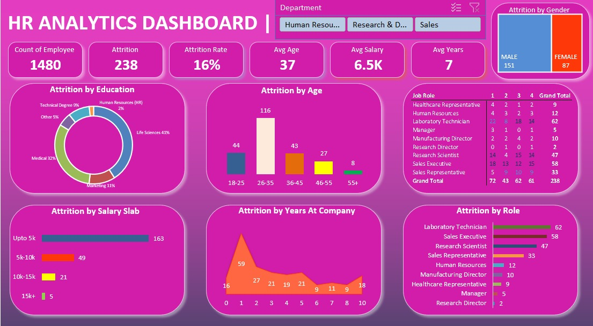

📊 HR Analytics Dashboard (Excel)

📌 Project Overview

This project presents an interactive HR Analytics Dashboard built using Microsoft Excel to analyze employee data and uncover key workforce insights.

The dashboard helps organizations monitor employee attrition, demographics, salary trends, and job roles, enabling data-driven HR decisions.

------

🚀 Key Features
The dashboard provides the following insights:

• 👥 Total Employee Count – Overall workforce size.

• 🔁 Attrition Analysis – Total attrition & attrition rate.

• 🎓 Attrition by Education – Understand employee background trends.

• 👨‍💼 Attrition by Job Role – Identify high-risk roles.

• 💰 Attrition by Salary Slab – Analyze salary impact on attrition.

• 📊 Attrition by Age Group – Workforce age distribution insights.

• ⏳ Years at Company Analysis – Retention patterns over time.

• 🚻 Attrition by Gender – Gender-based attrition comparison.

• 🎯 Department Filters (Slicers) – Interactive data exploration.
----

📂 Dataset Information

The dataset includes the following fields:

• Employee ID

• Age

• Gender

• Department

• Job Role

• Education Field

• Salary

• Years at Company

• Attrition Status
----
🛠 Tools & Techniques Used

• Microsoft Excel

• Pivot Tables & Pivot Charts

• Slicers (Interactive Filters)

• Data Cleaning & Transformation

• Dashboard Design & Visualization

• Conditional Formatting
----
📈 Dashboard Components

The Excel file includes:

• Dashboard – Main interactive visualization

• Raw Data Sheet – Source dataset

• Pivot Tables – Backend calculations

• Charts & Graphs – Visual insights
----
🎯 Key Insights

Using this dashboard, users can:

• Identify departments with high attrition rates

• Analyze salary vs attrition relationship

• Understand employee demographics trends

• Track retention patterns over years

• Compare job role performance and risk
----
📌 How to Use

1. Download the Excel file from this repository

2. Open in Microsoft Excel (2016 or later recommended)

3. Go to the Dashboard sheet

4. Use slicers and filters to explore insights
----
📷 Dashboard Preview

----
📚 Learning Purpose

This project is ideal for:

• Practicing Data Analysis in Excel

• Learning Dashboard Design

• Understanding HR Metrics & KPIs

• Building a Data Analyst Portfolio Project
----
👤 Author

Himanshu Sharma
----
⭐ Support

If you found this project useful, feel free to star ⭐ the repository and share your feedback!
